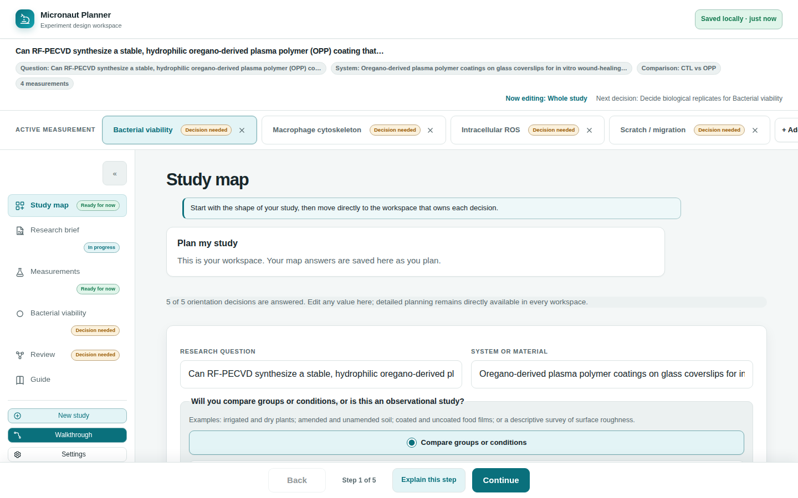
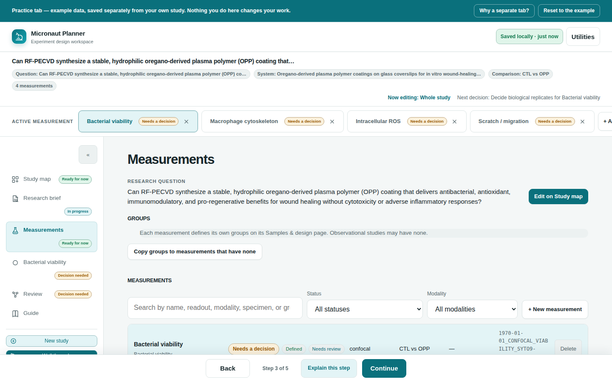

# μicronaut

μicronaut — a static, zero-install **microscopy experiment planner**.
(The µ is the micron symbol; the project name is pronounced "Micronaut.")

The active project is the web **Planner** (`web/`).

| Tool | What it is | Status |
|------|------------|--------|
| **Micronaut Planner** (`web/`) | A static, zero-install browser app for planning a microscopy study: what you're asking, what you'll measure, and the files, controls and conditions that follow from it — decided before you're at the microscope. No upload, no install, no server, and no model is ever called. | **Active** |

Micronaut Classic, an earlier metadata-aware file renamer, was archived at tag
`classic-final` — see ROADMAP.md for why.

---

# Micronaut Planner (`web/`)

A static, single-page experiment planner. Vanilla ES modules with **zero npm
dependencies**, flattened at build into one self-contained HTML file that runs
identically from `file://`, a local server, or GitHub Pages.

## What it does today

The planner is organized as a hierarchy, not a step count — these are things a
study *has*, not steps to march through, so jump to any of them in any order:

```text
Study
├── Study Map: question, system, comparison, experimental unit
├── Research Brief: study-wide narrative
├── Measurements registry
│   └── Measurement
│       ├── Samples & design
│       ├── Acquisition
│       └── Data plan
└── Review: whole-study synthesis and exports

Utilities
├── Guide / walkthrough
├── Backup, restore, and settings
└── Feedback
```

- **Study map** — the shape of the study: the research question, the system or
  material, whether you're comparing groups or observing, and what counts as one
  independent experimental unit. Everything else follows from these. A study can
  hold several measurements that share a question and test article, each with its
  own modality, panel, and specimen; the persisted schema keeps them in its
  compatible `assays` collection.
- **Research brief** — save a plain-language study description, then choose **Review
  description**. Micronaut first extracts only deterministic exact-text matches:
  marker aliases from the dictionary, biological-replicate counts, magnification,
  and unambiguous ISO dates. Everything else remains saved narrative unless the
  researcher explicitly reviews and accepts a suggestion.
- **Measurements registry** — a registry of the observations or analyses used to
  answer the study question: search it, filter by status or modality, and open one
  to plan it. A measurement is one observation or analysis; some disciplines call
  it an assay. Each row shows a single headline badge drawn from three
  independently scoped statuses — definition, plan, and export conformance —
  plus the other two axes as muted chips beside it, never one collapsed word;
  see [docs/plans/status-scopes.md](docs/plans/status-scopes.md) for the full
  model.
- **Measurement** — opening a row gives you that measurement's whole plan on one
  scroll, because these three decide each other:
  - *Samples & design* — groups, replication, and the conditions they generate.
  - *Acquisition* — modality, panel, and readouts/controls, with modality-specific
    advice (STED / confocal / widefield / light-sheet / SEM-TEM / Raman) from a
    rules knowledge base (`web/kb/advisor.json`), plus the **Color panel**: a
    qualitative spectral-spillover advisor over the measurement's fluorophores
    (excitation/emission peak-proximity flags, not a spectral-overlap integral;
    of the 157 entries in `web/kb/spectra.json`, 143 cite a vendor or publication
    source and 14 remain Claude-drafted and are badged unreviewed in-app — none
    is specialist-reviewed; the source URLs themselves live in
    [docs/references/planner-fluorophore-sources.json](docs/references/planner-fluorophore-sources.json),
    not in the shipped knowledge pack). An
    optional structured panel editor lets you name each channel's target and
    conjugation mode (direct antibody / indirect / genetically encoded / a
    direct-binding probe / self-labeling tag) — the fact-precise alternative to the
    free-text markers field, and what lets the controls engine tell whether an
    antibody is actually involved.
  - *Data plan* — the filename convention built from the finished design, reusing
    Classic's naming/validation logic ported to JS, plus a one-click **Download
    schedule (.ics)** export of the measurement's timing (built from the same
    timing interview) that imports into any calendar app.
- **Review** — a shareable study diagram, export checks (a pass/needs-review/
  blocked verdict built from the app's own validators — it does not validate
  scientific validity, statistical power, ethics approval, biosafety, or
  instrument suitability, and it does not check your Study map decisions;
  see Decisions for those), a deterministic walkthrough, a staged progression
  ladder (idea → advanced modality), and downloads: Markdown, an SVG study
  map, a CSV file manifest, a raw-data JSON
  dump, a per-measurement print-oriented bench card, and a separate **Copy prompt for
  your own LLM** action (+ the study as JSON) for discussing the finished plan
  in whatever LLM you already use.

### Utilities

- **Guide / walkthrough** — an in-app user guide, plus a deterministic guided
  walkthrough over the shipped example study; the entry point is always in the
  step nav, but the walkthrough itself only runs over a study that originated
  from the shipped example, which the app opens in the practice tab
  (`index.html?demo=1`) against its own storage, never against your real
  study.
- **Backup, restore, and settings** — export or import a project backup, and clear
  locally stored data.
- **Feedback** — a page that collects what you were doing, the current page,
  browser details, and your full study into one package you can copy, download, or
  take to a GitHub issue. The GitHub issue path pre-applies the `feedback` label
  (GitHub's new-issue form reads it from the link's own query string), so feedback
  opened from the app is one filterable group inside the repo — no server or
  credential involved. Nothing is sent anywhere unless you choose one of those
  actions.

## Screenshots

<p align="center">
  <br>
  <sub>Study map — the shape of a study at a glance.</sub>
</p>
<p align="center">
  <br>
  <sub>Measurements — a searchable registry, filterable by status and modality.</sub>
</p>

More screens (Research brief, Acquisition, Review, Guide, and dark theme) are
in [`docs/images/`](docs/images/) and on the
[release notes page](https://daniel-waiger.github.io/micronaut-planner/release-notes/#screenshots).
Regenerate them with `python3 tools/capture_screenshots.py`.

## On language models

**Micronaut never calls a model.** Every result in the app is deterministic, and
nothing a model produces is read back into your study. There is no API key, no
endpoint to configure, and no network request.

Only one thing in the app touches a language model at all, and it is one-way
and entirely external to the app:

- **Review → Copy prompt for your own LLM** hands you a block to paste into
  whatever model you already use: ground rules that keep it from inventing a
  marker or a setting, your study as JSON, the decisions Micronaut can tell you
  have not been made yet, and questions worth asking. You read the reply and act
  on it yourself — nothing it produces is parsed back into the study.

Everything else is deterministic, including **Research brief review**, which is
a plain exact-text scan of your saved description. It recognises marker aliases
from the dictionary, biological-replicate counts, magnification, and unambiguous
ISO dates — and nothing else. Each suggestion quotes the exact text it matched,
and no field is written until you choose **Accept suggestion** or **Replace
current value**. Everything the scan did not match stays narrative; the app
never claims to have understood your whole description.

Earlier versions could call a local Ollama endpoint and parse a pasted model
reply back into study fields. That path is gone. It only worked for people who
had Ollama installed, and it spent a lot of machinery guarding a write path that
saved a few seconds of typing you still had to check. Asking a model which
questions to ask about your own design is the part worth having; letting it fill
in your fields was not.

## Run it locally

Development (unbundled, served over HTTP so ES-module imports resolve):

```bash
python tools/serve_dir.py web
```

Then open the printed URL. (The `web/kb.dev.js` aggregate the unbundled page needs
is generated automatically by `tools/serve_dir.py` itself, from `web/kb/*.json`;
it's git-ignored because the built single file embeds the KB directly.)

Build the self-contained single file:

```bash
python tools/build_single_file.py --web-dir web --out dist
```

This inlines CSS, JS, and the knowledge pack into `dist/index.html` — one file you
can double-click (`file://`) or host anywhere, with identical bytes either way. The
build enforces hard gates (no `fetch()`, `XMLHttpRequest`, `WebSocket()`,
`navigator.sendBeacon`, or `EventSource()`; no top-level `await`; no
`type="module"` or static `import` statement surviving into the assembled
output; no duplicate top-level exports; no import cycles; a size ceiling) so
the shipped artifact can't silently break and can't silently reach the network.

Serve the built output the same way:

```bash
python tools/serve_dir.py dist
```

## Test it

```bash
node --test web/tests/*.test.js
```

No `npm install`, ever — `web/` is a deliberately zero-dependency project (the
minimal `web/package.json` only sets `"type": "module"`). The glob is required;
bare `node --test web/tests/` fails with `MODULE_NOT_FOUND` on Node 22.

---

## Repository layout

```
web/                         Micronaut Planner (static browser app)
  index.html                 dev entry (BUILD:* markers for the inliner)
  src/core/                  schema, store, tiered provenance, router, persistence
  src/engine/                naming, validation, interview, advisor, controls, spectra,
                             measurement status, render
  src/ui/steps/              home (study map), describe, study (registry),
                             measurement (composes design + panel + naming),
                             overview, guide, feedback, settings
  kb/                        knowledge pack (markers, stages, controls, advisor, spectra, …)
  styles/                    app.css (inlined into dist/index.html at build)
  manual/                    the in-app user guide's own static pages
  release-notes/             CHANGELOG.md and the release-notes web page
  tests/                     node --test suite (zero npm deps)

tools/build_single_file.py   Planner inliner → dist/index.html
tools/serve_dir.py           static dev server (PORT-aware)
tests/                       Python build-pipeline and browser e2e tests (pytest)
docs/                        plans, cma-lessons, images
```

The marker/fluorophore dictionary (`web/kb/markers.json`) is hand-edited and
canonical — see [web/kb/markers.README.md](web/kb/markers.README.md).

## Run the tests

JavaScript (Planner):

```bash
node --test web/tests/*.test.js
```

CI runs the JS suite plus the Planner's own Python build-pipeline tests
(`tests/test_single_file_build.py`, `tests/test_kb_json_valid.py`,
`tests/test_regex_conformance.py`, `tests/test_browser_cdp.py`) as two jobs
(`web-test` and `test`), and a separate browser end-to-end job (`tests/test_e2e_flows.py`) that is made to
fail outright if no Chrome/Chromium is present on the runner, rather than
silently skipping and reporting green — see
[.github/workflows/ci.yml](.github/workflows/ci.yml).

## Getting help, reporting a problem

- **A question, or "is the planner meant to do X?"** →
  [Discussions](https://github.com/Daniel-Waiger/micronaut-explorer/discussions). Nothing
  formal needed; the Q&A category has a short form that asks for the shape of your study.
- **Something behaves wrong** → open an issue and pick **Bug report**. The Feedback page
  (in the planner, under Utilities) builds a package with the page you were on, your browser,
  and the knowledge-pack health — paste the header lines from it into the form.
- **An idea** → **Feature request**, or Discussions if it is still half-formed.
- **A marker, spectrum, or suggested control the pack has wrong** → **Knowledge pack
  correction**. Corrections need a source we can check; "measured on our own instrument" is a
  valid one, as long as it says so.

The issue forms live in [.github/ISSUE_TEMPLATE/](.github/ISSUE_TEMPLATE/), and the Q&A
discussion form in [.github/DISCUSSION_TEMPLATE/](.github/DISCUSSION_TEMPLATE/) — that one binds
by filename to the discussion category's slug, so renaming the category means renaming the file.
Blank issues stay
enabled on purpose — the planner's own Feedback button opens a blank, pre-labelled issue, and
turning blank issues off would break that link. See the comment in
[config.yml](.github/ISSUE_TEMPLATE/config.yml).

**One privacy note that applies to all of them:** this repository is public, and the Feedback
package ends with your entire study as JSON — question, markers, conditions, file names. Paste
the short header lines, not the study, unless you are happy for it to be public.

## License

This project is licensed under the Apache License, Version 2.0. See the
[LICENSE](LICENSE) file for the full text.
