# μicronaut User Guide

*(The µ is the micron symbol; the project name is pronounced "Micronaut.")*

## Table of contents

1. [Overview](#1-overview)
2. [Getting started](#2-getting-started)
3. [Sidebar settings](#3-sidebar-settings)
4. [Folder Mode](#4-folder-mode)
5. [The Tag Files table](#5-the-tag-files-table)
6. [Planned Renames and Apply](#6-planned-renames-and-apply)
7. [Rollback Manager](#7-rollback-manager)
8. [Validation profiles](#8-validation-profiles)
9. [Drag-and-Drop Mode](#9-drag-and-drop-mode)
10. [Naming scheme (naming_scheme.json)](#10-naming-scheme-naming_schemejson)
11. [Tips and troubleshooting](#11-tips-and-troubleshooting)

---

## 1. Overview

μicronaut renames microscopy image files into a consistent, metadata-aware naming convention. It reads what it can from each file (acquisition date, and format-specific metadata for OME-TIFF, CZI, LIF, and ND2), falls back to filename and timestamp heuristics when it cannot, and builds a standardized name from a configurable template. You work in a simple loop: **preview** the suggested names for a folder, **tag/review** each file by editing its fields in a table (correcting anything the tool marked as needing review), then **apply** the renames to disk. Every apply writes a rollback manifest, so a mistaken batch rename can always be undone.

## 2. Getting started

Run the app from the project root:

```
streamlit run app_streamlit.py
```

Streamlit opens the UI in your browser. All work happens locally; nothing is uploaded to any server.

The app is driven by a config file, **`naming_scheme.json`**, which defines the naming template, the default (fallback) values for missing fields, and the optional LLM settings. You do not have to create it by hand: if the path in the sidebar does not point to an existing file, μicronaut writes a default `naming_scheme.json` for you on first run and shows an "Created default config" notice. See [section 10](#10-naming-scheme-naming_schemejson) for what each field controls.

## 3. Sidebar settings

The left sidebar holds all global settings. Changes to the LLM-related fields are saved back to your config file automatically (only when a value actually changes).

### Config path

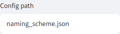

The path to your `naming_scheme.json`. This is where naming rules and LLM settings are read from and saved to. Change it to keep separate configs for different users, projects, or experiments. Example: `naming_scheme.json` (default) or `configs/confocal_lab.json`. If the file does not exist, a default one is created there.

### Ollama endpoint

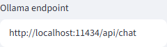

The URL of your local Ollama server, used only when LLM suggestions are enabled. Leave the default unless Ollama runs on another host or port. Example: `http://localhost:11434/api/chat`.

### LLM timeout (seconds)

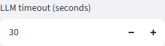

How long to wait for the local model to respond before giving up on a suggestion. Increase it for larger, slower models; decrease it if you want the app to fail fast. Accepts 5 to 120 seconds. Example: `30`.

### Use Ollama suggestions

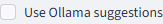

Turns optional local-LLM enrichment on or off. When on, μicronaut can propose values for fields it could not extract. It is entirely optional: with it off (the default), you tag every field yourself and the app never contacts a model. Example: leave unchecked unless you have Ollama running.

### LLM model

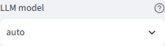

Which local Ollama model to use. Choose `auto` to let the app pick the first available model from your preferred list, or select a specific installed model. Example: `auto`, or `llama3.1:8b`. Models detected on your machine are added to the list automatically.

### Profile path (optional)

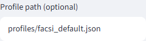

The path to a validation profile (JSON) that checks whether generated field values fit your lab's rules. Leave it blank to skip validation entirely. If the path does not exist, the app warns you and continues without validation. Example: `profiles/facsi_default.json`. See [section 8](#8-validation-profiles).

### Strict validation

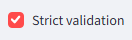

Controls what happens to files that have **error-severity** validation issues during a batch. When **on**, those files are skipped during apply (they will not be renamed, and appear in the skipped list). When **off**, files are renamed regardless of validation issues. Turn it on to enforce your profile; turn it off to rename everything and review issues separately. Example: on.

### Conflict strategy

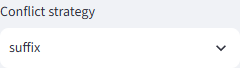

Decides what happens when two files would end up with the same target name. `suffix` (default) appends a numeric suffix so both survive; `skip` leaves the conflicting file unrenamed; `fail` treats the collision as an error. Choose `suffix` to keep every file, `skip` to touch only unambiguous ones. Example: `suffix`.

### Glob pattern

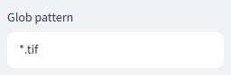

The filename pattern that selects which files in the folder are considered. Change it to match other extensions or naming shapes. Example: `*.tif` (default), `*.czi`, or `*.nd2`.

## 4. Folder Mode

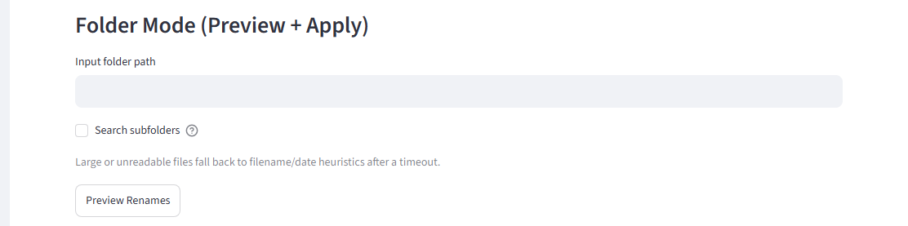

Folder Mode is where you preview and apply real renames on files already on disk.

- **Input folder path** — the folder containing the files to rename. Type an absolute path, e.g. `G:\data\2026-07-experiment`.
- **Search subfolders** — when checked, μicronaut recurses into nested folders; when unchecked (the default), only the top folder is scanned. Recursion is now opt-in, so you will not accidentally sweep an entire tree.
- **Preview Renames** — reads metadata for each matching file and plans the new names. Nothing is written to disk at this stage.

Large or unreadable files fall back to filename and date heuristics after a timeout rather than hanging. That timeout is governed by `extraction_timeout_seconds` in your config (default 20 seconds); such files simply get best-effort names you can correct in the table.

## 5. The Tag Files table

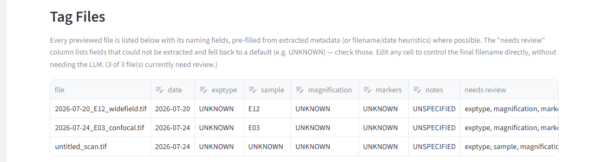

After you click **Preview Renames**, every previewed file appears as one row in the Tag Files table. This is the heart of the app.

- Each row shows the file's naming fields (date, exptype, sample, magnification, markers, notes), **pre-filled from extracted metadata** or from filename/date heuristics where possible.
- The **needs review** column lists any fields that could not be extracted and fell back to a default (such as `UNKNOWN`). Check those first — they are the values most likely to be wrong.
- The **issues** column shows validation problems (from your profile, if one is set), each as `severity:field`.
- You can **edit any editable cell directly** to control exactly what the final filename will be. No LLM is required — manual tagging alone fully drives the result. (The `file`, `needs review`, and `issues` columns are read-only.)

Two buttons sit below the table:

- **Apply tags & preview names** — takes your edited cells, re-runs sanitization and validation, and updates the planned target names. Use this after editing to see the result.
- **Suggest missing fields with LLM** — only fills fields that are *currently missing* (still on a default), and never overwrites values you or the metadata already provided. If no local model is available, it reports that gracefully and leaves your manual work untouched; you can still tag by hand.

## 6. Planned Renames and Apply

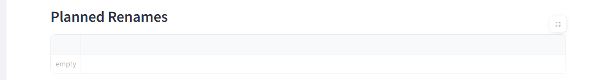

The **Planned Renames** table shows each `source` filename next to its `suggested` target — the exact rename that will happen. Review it before applying.

- **Download report (CSV)** and **Download report (JSON)** export the full source / target / issues list, useful for record-keeping or review before you commit.
- If any files were **skipped** (for example, due to strict validation or a conflict), they are listed under a "Skipped items" warning with the reason.
- **Apply Renames** performs the actual filesystem rename for every planned pair. On success it reports how many files were renamed and, importantly, **automatically writes a rollback manifest** so the batch can be undone later (see [section 7](#7-rollback-manager)).

## 7. Rollback Manager

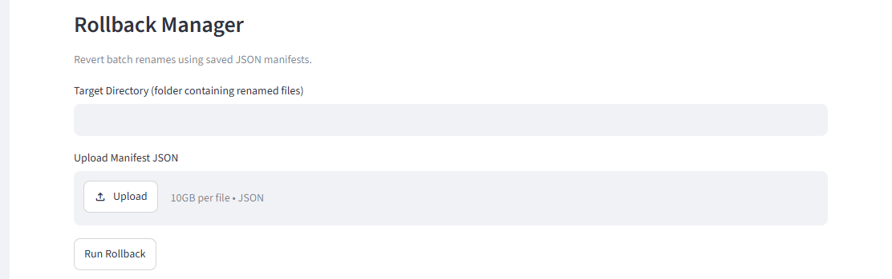

Every time you apply a batch, μicronaut writes a **timestamped JSON manifest** recording, for each file, its `original` and `target` paths (relative to the renamed folder). This makes any batch rename reversible.

**Where the manifest lives:** inside a `.manifests/` subfolder of the folder you renamed, named like `rename_manifest_20260725_143000.json`. If you are unsure which file to use, look in `.manifests/` inside the directory whose files you renamed and pick the one with the matching timestamp.

**How to roll back:**

1. In the **Target Directory** field, enter the folder where the renamed files currently live (the same folder you renamed).
2. Upload the manifest JSON for that batch under **Upload Manifest JSON**.
3. Click **Run Rollback**.

**How it reverts — precisely:** μicronaut processes the manifest in **reverse order** and, for each pair, only reverts when the **target file still exists** *and* the **original filename slot is free**. If the target is missing, or a file already occupies the original name, that pair is left alone and reported rather than overwritten.

**Why this matters:** rollback is designed to undo a mistaken batch rename safely. Because it never overwrites an existing file and only touches pairs it can restore cleanly, it is non-destructive by design — you can run it with confidence that it will not clobber unrelated work.

## 8. Validation profiles

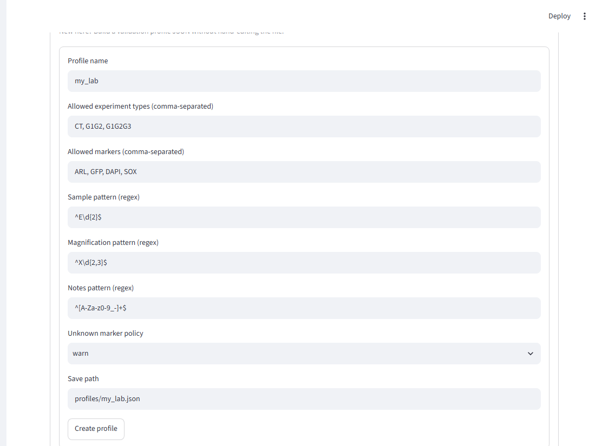

A **validation profile** is a small JSON file of naming rules for a lab or user. When a profile is set (via the sidebar **Profile path**), μicronaut checks each generated file's fields against it and reports issues in the table.

### What each profile field does

| Field | What it checks | Example |
|-------|----------------|---------|
| `allowed_experiment_types` | The set of permitted experiment-type codes. **Empty = no restriction.** | `["CT", "G1G2", "G1G2G3"]` |
| `allowed_markers` | The set of permitted marker names. **Empty = no restriction.** | `["ARL", "GFP", "DAPI", "SOX"]` |
| `sample_pattern` | A regex the `sample` field must fully match | `^E\d{2}$` (E01, E42, …) |
| `magnification_pattern` | A regex the `magnification` field must fully match | `^X\d{2,3}$` (X40, X100, …) |
| `notes_pattern` | A regex the `notes` field must fully match | `^[A-Za-z0-9_-]+$` |
| `unknown_marker_policy` | What to do with markers not in `allowed_markers` | `warn` / `allow` / `block` |

### Empty allow-lists mean "no restriction"

This is important and is the current default, permissive behavior: an **empty** `allowed_experiment_types` or `allowed_markers` list means **any value passes** for that field — it does *not* mean "reject everything." Only a **non-empty** list restricts values. So a starter profile with empty allow-lists validates the pattern-based fields (sample, magnification, notes) while accepting any experiment type or marker. Populate a list only when you actually want to constrain that field.

### unknown_marker_policy modes

This applies only when `allowed_markers` is non-empty and a file has a marker that is not on the list.

| Mode | Effect on an unknown marker |
|------|-----------------------------|
| `warn` | Reports a **warning**-severity issue (does not block under strict mode) |
| `allow` | Silently accepts it; no issue is raised |
| `block` | Reports an **error**-severity issue (blocked when strict validation is on) |

### The "Create a validation profile" wizard

Rather than hand-editing JSON, expand **Create a validation profile** at the bottom of the app to build one through a form. Fill in the profile name, comma-separated allowed experiment types and markers, the three regex patterns, and the unknown-marker policy, then set a **Save path** (e.g. `profiles/my_lab.json`) and click **Create profile**. Point the sidebar Profile path at the file you saved to start using it.

### A stricter example to model on

`profiles/facsi_default.json` ships as an explicitly-named example of a **more restrictive** profile: fixed experiment codes (`CT`, `G1G2`, `G1G2G3`), a fixed marker list, and tight `E##` / `X##` patterns. It is a demonstration to adapt for your own lab, not a default any lab must use as-is — copy it and tighten or loosen the rules to match your conventions.

## 9. Drag-and-Drop Mode

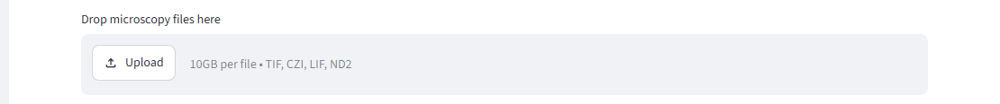

Drag-and-Drop Mode is a **safe, preview-only** way to check suggested names for files you upload. It reads each uploaded file in a temporary location and shows the suggested name, any validation issues, and which fields were defaulted — but it **never modifies your original files**. Use it for a quick sanity check on a few files without pointing the app at a folder or committing to any rename. It accepts `.tif`, `.tiff`, `.czi`, `.lif`, and `.nd2` files.

## 10. Naming scheme (naming_scheme.json)

The config file controls how names are built. You can edit it directly or manage the LLM parts from the sidebar.

| Field | Controls |
|-------|----------|
| `template` | The naming pattern. Default: `{date}_{exptype}_{sample}_{magnification}_{markers}_{notes}{ext}`. Field separators live entirely in the template; multiple markers are always joined with `-`. |
| `defaults` | Fallback values used when a field cannot be extracted. Ships with neutral placeholders (`UNKNOWN`, and `UNSPECIFIED` for notes) so unresolved fields stand out. |
| `uppercase_fields` | Which fields are forced to uppercase. Default: `exptype`, `sample`, `magnification`, `markers`. |
| `safe_char_pattern` | A regex of characters stripped/replaced to keep filenames filesystem-safe. Default: `[^A-Za-z0-9_-]+`. |
| `extraction_timeout_seconds` | How long to attempt metadata extraction per file before falling back to heuristics. Default: `20`. |
| `llm.enabled` | Whether LLM suggestions are on. |
| `llm.model` | The Ollama model to use, or `auto`. |
| `llm.preferred_models` | Priority order used when `model` is `auto`. |
| `llm.endpoint` | The Ollama server URL. |
| `llm.timeout_seconds` | Per-request LLM timeout. |

## 11. Tips and troubleshooting

- **"No local Ollama models detected"** — this warning appears when *Use Ollama suggestions* is on but no model is installed or Ollama is not running. The app continues safely without LLM enrichment; tag fields manually or start Ollama and pull a model.
- **`UNKNOWN` (or `UNSPECIFIED`) in a suggested name** — that field fell back to a default because it could not be extracted. It is flagged in the *needs review* column; edit the cell to the correct value before applying.
- **Where manifests live** — in a `.manifests/` subfolder of the folder you renamed, one timestamped JSON per apply. Keep them if you might need to roll back.
- **Recursion is opt-in** — only the top folder is scanned unless you check *Search subfolders*.
- **CLI equivalents exist** — for scripting or batch pipelines, the `mna` command mirrors the UI: `mna suggest` (one file), `mna batch` (preview or, with `--apply`, rename a folder), and `mna rollback` (undo using a manifest). Batch mode is dry-run unless you pass `--apply`. See the README for full CLI usage.
